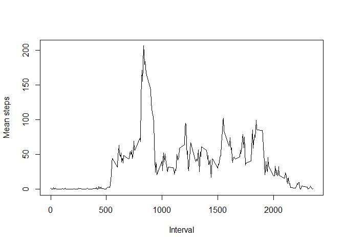
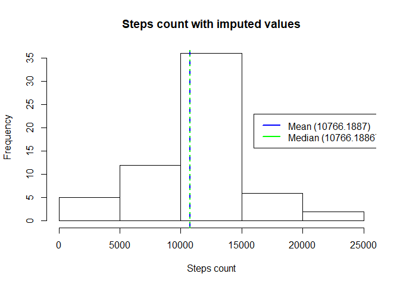

Setup the environnement
-----------------------

First of all get our environnement ready

``` r
library(data.table)
```

    ## Warning: package 'data.table' was built under R version 3.4.4

``` r
library(ggplot2)
```

    ## Warning: package 'ggplot2' was built under R version 3.4.4

``` r
dir.create(file.path("../Reproductible Research - peer assignment week2"), showWarnings = FALSE)
setwd("../Reproductible Research - peer assignment week2")
```

``` r
temp <- tempfile()
download.file("https://d396qusza40orc.cloudfront.net/repdata%2Fdata%2Factivity.zip", destfile = temp)
activity <- read.csv(unz(temp, "activity.csv"))
unlink(temp)

activity <- as.data.table(activity)
```

Okay, let's go! \#\# What is mean total number of steps taken per day?

``` r
steps_per_date <- aggregate(activity$steps, by=list(Date = activity$date), FUN=sum)

my_mean <- mean(steps_per_date$x, na.rm = T)
my_median <- median(steps_per_date$x, na.rm = T)

hist(steps_per_date$x, main = "Histogram of steps per day")
abline(v=my_mean, col=c("blue"), lwd=2, lty=2)
abline(v=my_median, col=c("green"), lwd = 2, lty=3)
legend(x=16000, y=23,  legend = c(paste0("Mean (", round(my_mean, digits = 4), ")") , paste0("Median (",my_median, ")")), lwd=2, col=c("blue", "green"))
```


What is the average daily activity pattern?
-------------------------------------------

``` r
steps_per_interval <- aggregate(activity$steps, by=list(Interval = activity$interval), FUN=mean, na.rm=T)
steps_per_interval <- as.data.table(steps_per_interval)
my_max <- steps_per_interval[steps_per_interval$x == max(steps_per_interval$x),]

plot(type="l", x=steps_per_interval$Interval, y=steps_per_interval$x, xlab = "Interval", ylab="Mean steps" )
```

 \#\#\# Maximum average number of steps per interval

``` r
print(paste0("Maximum mean of steps (", my_max$x, ") is on interval ", my_max$Interval))
```

    ## [1] "Maximum mean of steps (206.169811320755) is on interval 835"

Imputing mising values
----------------------

### How many missing values are in this dataset?

``` r
x <- activity[complete.cases(activity) == FALSE,`:=`(COUNT=.N)]
print(x[1, COUNT])
```

    ## [1] 2304

### Impute missing steps

Missing steps are imputed as the mean of the value over the interval. Result is stored in a new data table.

``` r
library(dplyr)
```

    ## 
    ## Attaching package: 'dplyr'

    ## The following objects are masked from 'package:data.table':
    ## 
    ##     between, first, last

    ## The following objects are masked from 'package:stats':
    ## 
    ##     filter, lag

    ## The following objects are masked from 'package:base':
    ## 
    ##     intersect, setdiff, setequal, union

``` r
library(plyr)
```

    ## Warning: package 'plyr' was built under R version 3.4.4

    ## -------------------------------------------------------------------------

    ## You have loaded plyr after dplyr - this is likely to cause problems.
    ## If you need functions from both plyr and dplyr, please load plyr first, then dplyr:
    ## library(plyr); library(dplyr)

    ## -------------------------------------------------------------------------

    ## 
    ## Attaching package: 'plyr'

    ## The following objects are masked from 'package:dplyr':
    ## 
    ##     arrange, count, desc, failwith, id, mutate, rename, summarise,
    ##     summarize

``` r
library(data.table)
impute.mean <- function(x) replace(x, is.na(x), mean(x, na.rm = TRUE))

activity2 <- activity

activity2 <- activity2 %>%
    group_by(interval) %>%
    mutate(
        steps = impute.mean(steps)
    )


activity2$COUNT = NULL
#activity2 <- activity2[is.na(activity2$steps), steps := impute.mean(steps), by=interval]
```

### Histogram of steps whith imputed missing values

``` r
hist(tapply(activity2$steps, activity2$date, sum), xlab = "Steps count", main = "Steps count with imputed values")

steps_per_date2 <- aggregate(activity2$steps, by=list(Date = activity2$date), FUN=sum)

my_mean2 <- mean(steps_per_date2$x)
my_median2 <- median(steps_per_date2$x)

abline(v=my_mean2, col=c("blue"), lwd=2, lty=2)
abline(v=my_median2, col=c("green"), lwd = 2, lty=3)
legend(x=16000, y=23,  legend = c(paste0("Mean (", round(my_mean2, digits = 4), ")") , paste0("Median (",my_median2, ")")), lwd=2, col=c("blue", "green"))
```



Mean and median did not change after the imputation of NA using the mean of the interval.

Are there differences in activity patterns between weekdays and weekends?
-------------------------------------------------------------------------

Let's add a factor to type the day...

``` r
library(lubridate)
```

    ## 
    ## Attaching package: 'lubridate'

    ## The following object is masked from 'package:plyr':
    ## 
    ##     here

    ## The following objects are masked from 'package:data.table':
    ## 
    ##     hour, isoweek, mday, minute, month, quarter, second, wday,
    ##     week, yday, year

    ## The following object is masked from 'package:base':
    ## 
    ##     date

``` r
activity2$day <- ifelse(wday(activity2$date) %in% c(0, 6), "weekend", "weekday")
```

And plot week days and weekends to see if there is some difference

``` r
library(data.table)
par <- par(mfrow = c(1, 2))
wd <- activity2[activity2$day == "weekday",]
we <- activity2[activity2$day == "weekend",]

wd_means <- as.numeric(tapply(wd$steps, wd$interval, mean))
we_means <- as.numeric(tapply(we$steps, we$interval, mean))

means_per_interval <- data.table(intervals = as.numeric(activity2$interval), wd_means, we_means)

plot(means_per_interval$intervals, means_per_interval$wd_means, type="l", col="blue")
plot(means_per_interval$intervals, means_per_interval$we_means, type="l", col="green")
```

 We can see that there are some differences.Maybe should we deiplay both curves together?

``` r
plot(means_per_interval$intervals, means_per_interval$wd_means, type="l", col="blue")
lines(means_per_interval$intervals, means_per_interval$we_means, type="l", col="green")
```


